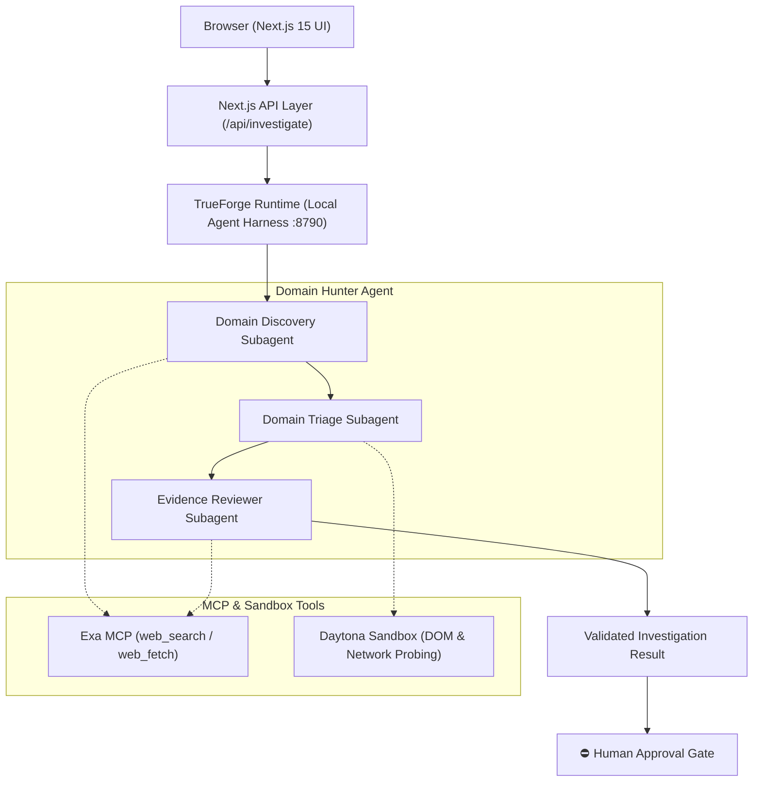

# Domain Hunter

An evidence-first brand impersonation investigation agent built on TrueForge.

---

## What it does

Domain Hunter discovers suspicious domains associated with a brand, performs live triage, separates current observations from historical threat intelligence, and produces an evidence-backed classification for human review.

A standard conversational chatbot can speculate that a phishing domain exists. Domain Hunter **discovers candidate domains via verified logs, inspects active infrastructure and live content, audits evidence provenance, and gates consequential takedown actions behind human approval.**

---

## Architecture



> **Deployment Architecture:**  
> The public Vercel deployment is a UI preview. The complete live investigation pipeline requires a local TrueForge runtime (`http://localhost:8790`). Localhost is used as the local developer and agent execution harness, not as public production infrastructure.

---

## Investigation Workflow

1. **Brand input** — User specifies the target brand name.
2. **Domain discovery** — Agent queries Certificate Transparency logs, DNS buffers, and search indices for lookalike domains.
3. **Candidate extraction** — Discovered domains are extracted strictly from telemetry results.
4. **Live domain triage** — Probes active DNS records, IP geo-location, HTTP response headers, and SSL certificates.
5. **Historical evidence collection** — Aggregates public web intelligence and historical reputation feeds via Exa MCP.
6. **Evidence review** — Cross-references live observations against historical intel to eliminate false positives.
7. **Classification** — Evaluates forensic evidence to assign a confidence-scored classification.
8. **Human review** — Hard-blocking approval gate requires explicit operator consent before any external action.
9. **Final report** — Compiles a cryptographic evidence dossier and legal takedown notices (Abuse, DMCA, UDRP).

---

## Evidence Integrity

- **No guessed domains:** Candidate domains must originate directly from actual discovery results and telemetry logs.
- **Separation of state:** Current observations (active DNS, HTTP status, DOM artifacts) and historical records are strictly segregated.
- **Honest telemetry:** Missing or unverified telemetry is explicitly marked as `UNKNOWN` or `UNAVAILABLE` rather than assumed or synthesized.
- **Temporal distinction:** Historical threat evidence does not prove current active impersonation.
- **Proper lifecycle handling:** Inactive or parked domains are classified as `PARKED_OR_INACTIVE`.
- **Human-in-the-Loop:** Consequential recommendations (such as automated takedowns or registrar abuse reporting) require manual analyst authorization.

---

## Classifications

| Classification | Meaning |
|---|---|
| **`LEGITIMATE`** | Official brand asset or verified infrastructure with confirmed legitimate ownership. |
| **`SUSPICIOUS`** | Deceptive naming patterns, typo-squatting, or conflicting records requiring active monitoring. |
| **`LIKELY_IMPERSONATION`** | High-confidence active brand impersonation, credential harvesting forms, or cloned assets. |
| **`INCONCLUSIVE`** | Telemetry is contradictory or insufficient to make a definitive risk determination. |
| **`PARKED_OR_INACTIVE`** | Registered domain with no live hosting, MX records, or deceptive web content. |

---

## TrueForge

TrueForge provides the execution harness that powers Domain Hunter:

- **Agent Sessions:** Manages multi-turn stateful investigation lifecycles.
- **Sandbox Execution:** Runs safe DOM inspection and network probes inside isolated Daytona workspaces.
- **MCP Tool Integration:** Connects EXA MCP (`web_search_exa`, `web_fetch_exa`) for public domain research.
- **Streaming Events:** Streams granular SSE events (phases, tool executions, subagent threads) to the UI in real time.
- **Human-in-the-Loop Orchestration:** Pauses execution turns on `tool.approval_required` events until operator approval is granted.

---

## Demo

- **Vercel UI Preview:** Deployed on Vercel as a publicly accessible UI preview.
- **Local Live Demo:** Full end-to-end investigation with live agent execution runs locally with TrueForge.
- **Representative Merged PR:** [PR #4: fix: remediate Qodo investigation integrity findings](https://github.com/oNk2r/domain-hunter/pull/4)

---

## Qodo Code Review Evidence

- **Representative Merged PR:** [https://github.com/oNk2r/domain-hunter/pull/4](https://github.com/oNk2r/domain-hunter/pull/4)
- **Summary of Findings:** Qodo conducted an automated security and integrity audit on the Domain Hunter codebase. Findings highlighted:
  1. Telemetry verification and timeline milestones were coupled to log-derived tool strings rather than explicit SSE event payloads.
  2. Potential race condition where stage proven milestones could trigger before non-empty subagent result payloads were recorded.
  3. Inconsistencies in confidence calculation where missing telemetry could produce ambiguous or default score values.
  4. Subagent error handling needing normalization for object-wrapped error returns.
- **What Was Fixed:**
  1. Decoupled telemetry verification and timeline milestones from log string parsing; implemented `extractStageTelemetryFromEvents` to verify milestones strictly from explicit SSE events.
  2. Added payload validation in `isValidSubagentResult` to ensure non-empty results before marking investigation stages proven.
  3. Enforced explicit handling of missing confidence data as `UNKNOWN / UNAVAILABLE` with deterministic scoring fallback.
  4. Applied normalized error string validation to object-wrapped subagent outputs.
- **Follow-up Review:** A follow-up Qodo review was performed on the remediation branch, confirming that all evidence integrity and telemetry provenance issues were fully resolved.
- **Final PR Status:** Merged into `main`.

---

## Running Locally

### Prerequisites

- Node.js 18+ or 20+
- TrueForge runtime installed locally (`npx @truefoundry/trueforge`)
- EXA API key (configured inside TrueForge for MCP web search)

### 1. Clone the repository

```bash
git clone https://github.com/oNk2r/domain-hunter.git
cd domain-hunter
```

### 2. Install dependencies

```bash
npm install
```

### 3. Start TrueForge Runtime

In a separate terminal, launch the local TrueForge agent runtime:

```bash
npx @truefoundry/trueforge
```

TrueForge will start at `http://localhost:8790`.

1. Open `http://localhost:8790` in your browser.
2. In **Settings → Models**, configure your LLM provider.
3. In **Settings → Connectors**, configure the EXA MCP server.
4. Ensure an agent named `domain-hunter` is configured with MCP tools enabled.

### 4. Start Next.js Development Server

```bash
npm run dev
```

Open [http://localhost:3000](http://localhost:3000) to start live investigations.
