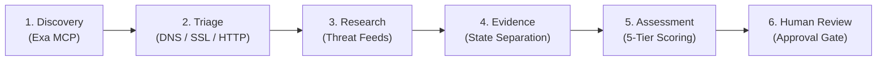
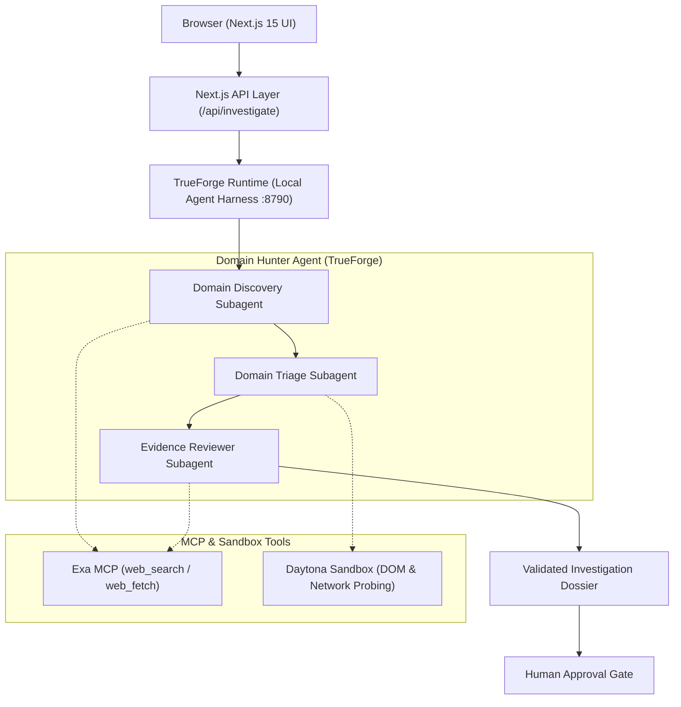

# Domain Hunter

An evidence-first brand impersonation investigation agent built on TrueForge.

[](https://www.truefoundry.com/)
[](https://nextjs.org/)
[](https://github.com/oNk2r/domain-hunter/pull/4)
[](LICENSE)

**Team:** Rootless  
**Hackathon:** The Agent Harness Hackathon (WeMakeDevs × TrueFoundry × Qodo)
---

## Executive Summary

| Category | Details |
|---|---|
| **What It Does** | Discovers, inspects, and classifies lookalike domains targeting a brand using structured forensic evidence. |
| **TrueForge Role** | Provides the agent harness, multi-turn session lifecycle, Daytona sandbox DOM probing, Exa MCP connectors, SSE event streaming, and the human approval gate. |
| **Integrity Model** | Eliminates hallucinations via strict discovery telemetry, segregates live observations from historical records, and prevents autonomous external actions. |

---

## Problem & Solution

### Problem
Brand protection teams face thousands of newly registered lookalike domains daily:
- **Search Noise & Hallucinations:** Keyword searches produce high noise, while standard LLMs invent fake domains.
- **Conflated Temporal State:** Historical reputation feeds frequently mark inactive or parked domains as active threats.
- **Manual Overhead:** Analysts spend hours querying DNS, inspecting HTTP headers, and manually assembling takedown evidence.

### Solution
**Domain Hunter** runs a structured, forensic investigation pipeline that inspects live infrastructure in real time, cross-references historical intelligence, and produces audit-ready evidence dossiers—strictly gating all consequential actions behind human analyst approval.

---

## How It Works

Domain Hunter follows a disciplined 6-stage sequential investigation workflow:



1. **Discovery** — Discovers candidate lookalike domains using verified search queries and Certificate Transparency logs via Exa MCP.
2. **Triage** — Actively inspects DNS resolution, IP hosting, HTTP headers, and SSL certificate validity.
3. **Research** — Gathers historical threat intelligence and reputation records.
4. **Evidence** — Compiles technical evidence while strictly segregating current observations from past data. Missing signals are explicitly marked as `UNKNOWN` / `UNAVAILABLE`.
5. **Assessment** — Scores risk confidence and assigns one of five deterministic classifications.
6. **Human Review** — Enforces a hard-blocking approval gate requiring analyst sign-off before generating or dispatching any external takedown action.

---

## TrueForge: The Agent Runtime Harness

TrueForge is the core execution runtime powering Domain Hunter:

```
+-------------------------------------------------------------+
|                      Next.js 15 UI                          |
|               (Real-time SSE Investigation Feed)            |
+------------------------------+------------------------------+
                               | POST /api/investigate
+------------------------------v------------------------------+
|             TrueForge Runtime (:8790)                       |
|  +-------------------------------------------------------+  |
|  | Agent Session (`domain-hunter`)                       |  |
|  | * Multi-turn Execution & State Persistence            |  |
|  | * Exa MCP Bridge (web_search_exa, web_fetch_exa)      |  |
|  | * Daytona Sandbox (DOM & Network Probing)             |  |
|  | * Human-in-the-Loop Approval Gate Interceptor         |  |
|  +-------------------------------------------------------+  |
+-------------------------------------------------------------+
```

- **Agent Runtime & Lifecycle:** Manages stateful multi-turn investigation sessions and streams real-time Server-Sent Events (SSE) to the UI.
- **MCP Tool Integration:** Connects Model Context Protocol tools (`web_search_exa`, `web_fetch_exa`) for safe external domain reconnaissance.
- **Isolated Sandbox Execution:** Executes deep DOM analysis and network probing inside isolated Daytona workspaces.
- **Human-in-the-Loop Safety Boundary:** Intercepts high-impact tool calls (`tool.approval_required`), halting execution until the human analyst explicitly approves.

> **Deployment Architecture Note:**  
> The Vercel deployment provides a live interactive UI preview. Full live investigations with streaming agent tool executions run through the local TrueForge harness (`http://localhost:8790`).

---

## Architecture



---

## Features

- **Automated Lookalike Discovery:** Real domain discovery via search telemetry without hallucinatory guessing.
- **Live Infrastructure Triage:** Probes DNS records, IP geo-location, HTTP response headers, and SSL certificates.
- **Evidence Provenance Segregation:** Rigorous separation between current live observations and historical threat intel.
- **Deterministic 5-Tier Classification:** Evaluates forensic evidence into actionable risk categories.
- **Interactive Investigation Board:** Visual timeline and live telemetry stream displaying real-time agent execution milestones.
- **Cryptographic Evidence Dossier:** Generates tamper-evident, audit-ready investigation packages.
- **Legal Notice Generator:** Pre-drafts formatted Registrar Abuse, DMCA, and UDRP takedown notices.
- **Human-in-the-Loop Gate:** Hard safety stop requiring analyst sign-off before taking any external action.

---

## Classifications

| Classification | Definition | Actionable Outcome |
|---|---|---|
| **`LEGITIMATE`** | Official brand asset or verified infrastructure with confirmed legitimate ownership. | Allowlisted; no action. |
| **`SUSPICIOUS`** | Deceptive naming patterns, typo-squatting, or conflicting records. | Queued for active monitoring. |
| **`LIKELY_IMPERSONATION`** | High-confidence active brand impersonation, credential harvesting forms, or cloned assets. | Flagged for takedown approval. |
| **`INCONCLUSIVE`** | Telemetry is contradictory or insufficient for definitive determination. | Flagged for manual analyst triage. |
| **`PARKED_OR_INACTIVE`** | Registered domain with no live hosting, active MX records, or deceptive content. | Archived; monitor for reactivation. |

---

## Safety & Control Principles

- **Separation of State:** Current live observations (DNS, HTTP headers, DOM) and historical threat logs are strictly isolated. Historical reputation does not falsely label parked domains as active threats.
- **Strict Provenance:** Candidate domains originate exclusively from verified discovery telemetry—never hallucinated.
- **Honest Telemetry:** Unreachable servers or missing records are explicitly marked `UNKNOWN` / `UNAVAILABLE`.
- **Zero Autonomous Consequential Actions:** The agent never autonomously files abuse reports, contacts domain owners, or triggers takedowns. Every action requires analyst authorization.

---

## Qodo Code Review Evidence

Team Rootless utilized **Qodo Merge** to conduct automated code reviews, enforce evidence integrity, and validate pull requests.

- **Representative Merged PR:** [https://github.com/oNk2r/domain-hunter/pull/4](https://github.com/oNk2r/domain-hunter/pull/4)  
  *(Title: `fix: remediate Qodo investigation integrity findings`)*

### What Qodo Surfaced:
1. **Telemetry Milestone Coupling:** Telemetry verification and milestone tracking were coupled to log-derived tool name strings rather than explicit SSE event payloads, creating potential desynchronization.
2. **Premature Stage Verification:** Potential race condition where stage proven status could be asserted on `thread.done` before validating non-empty subagent result payloads.
3. **Confidence Scoring Inconsistencies:** Inconsistent fallback handling when telemetry was incomplete, risking misleading confidence metrics.
4. **Error Handling Structure:** Subagent error propagation required normalized string extraction when handling object-wrapped error payloads.

### What Team Rootless Decided & Changed:
1. **Decoupled Telemetry Verification:** Implemented `extractStageTelemetryFromEvents` to evaluate milestones strictly against explicit SSE event structures.
2. **Payload Validation Gate:** Added strict validation in `isValidSubagentResult` to ensure non-empty results before marking investigation stages as proven.
3. **Explicit Unknown Telemetry Fallbacks:** Standardized fallback scoring to mark missing telemetry explicitly as `UNKNOWN / UNAVAILABLE` with deterministic scoring constraints.
4. **Normalized Error Handling:** Applied normalized error string validation across subagent execution threads.

### Follow-up Review:
A follow-up review was executed against the remediation commits, confirming all evidence integrity, telemetry provenance, and payload validation issues were resolved prior to merging into `main`.

---

## Tech Stack

- **Frontend & Web Framework:** [Next.js 15](https://nextjs.org/) (App Router), [React 19](https://react.dev/), [TypeScript](https://www.typescriptlang.org/), [Tailwind CSS](https://tailwindcss.com/), [Lucide React](https://lucide.dev/)
- **Agent Harness & Runtime:** [TrueForge](https://www.truefoundry.com/) (`@truefoundry/trueforge-sdk`), Local TrueForge Agent Runtime (`:8790`)
- **Tooling & Connectors:** Model Context Protocol (MCP), [Exa Search MCP](https://exa.ai/), [Daytona Sandbox](https://www.daytona.io/)
- **Code Review & Quality Assurance:** [Qodo Merge](https://www.qodo.ai/)

---

## Running Locally

### Prerequisites
- Node.js 18+ or 20+
- TrueForge runtime installed locally (`npx @truefoundry/trueforge`)
- Exa API Key (configured in TrueForge for MCP web search)

### 1. Clone the Repository
```bash
git clone https://github.com/oNk2r/domain-hunter.git
cd domain-hunter
```

### 2. Install Dependencies
```bash
npm install
```

### 3. Start TrueForge Agent Runtime
In a separate terminal window:
```bash
npx @truefoundry/trueforge
```
TrueForge will start at `http://localhost:8790`.
1. Open `http://localhost:8790` in your browser.
2. In **Settings → Models**, configure your LLM provider.
3. In **Settings → Connectors**, configure the **Exa MCP** server.
4. Ensure an agent named `domain-hunter` is configured with MCP tools enabled.

### 4. Start Next.js Application
```bash
npm run dev
```
Open [http://localhost:3000](http://localhost:3000) in your browser to run live brand impersonation investigations.

---

## Demo

- **Recorded Video Walkthrough (2:22):** [https://youtu.be/qI86QyzJe68](https://youtu.be/qI86QyzJe68)  
  *Demonstrates full PayPal investigation, live candidate triage, 5-tier classification, cryptographic evidence dossier, and local TrueForge harness execution.*
- **Interactive UI Preview:** Deployed on Vercel as a live interactive UI preview.

---

## AI Assistant Disclosure

AI coding assistants were used during development for implementation, debugging, and documentation. Team Rootless reviewed, tested, and validated the submitted code and remains responsible for the final implementation.

---

## Team

**Team Rootless**  
Submission for *The Agent Harness Hackathon* (WeMakeDevs × TrueFoundry × Qodo)

---

## License

This project is licensed under the [MIT License](LICENSE).
